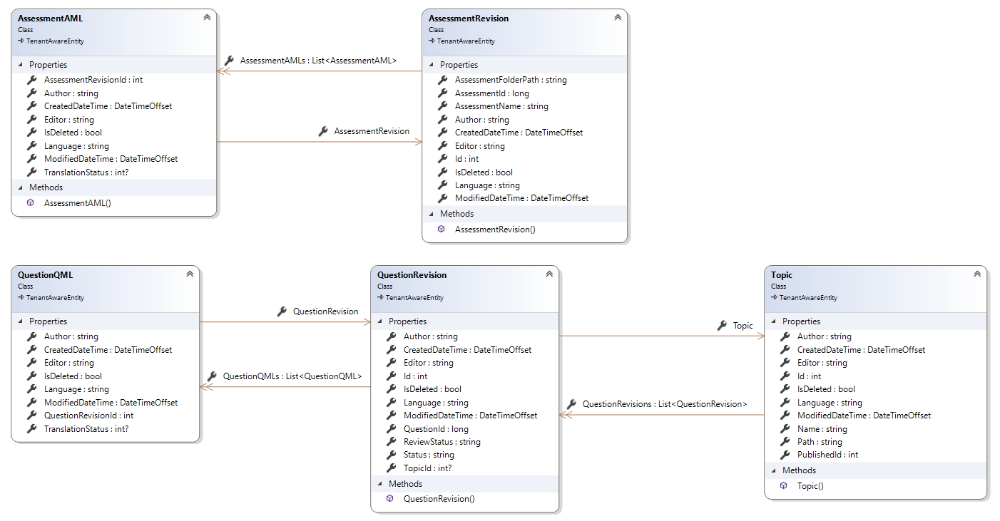

# Consuming Questionmark AuthoringAPI OData

The purpose of this repository is to provide an example on how to consume Questionmark AuthoringAPI OData feeds.

The complete and detailed documentation can be found [here](https://questionmark.github.io/qm-oap-docs/authoringodata.html), please refer to the official documentation page for more details.

Despite this is particularly oriented for C# developers, the examples provided using the plain HttpClient should be easily understood by any other developer which needs to consume the feeds using another technology.
This documentation should facilitate the understanding and we invite add questions to the Issue(LINK) section if support is needed.

Note that this code is not production ready, make sure you correctly handle missing data, failures, disconnections and any other possible issue.

## OData

To describe OData let's borrow the Wikipedia definition "Open Data Protocol is an open protocol which allows the creation and consumption of queryable and interoperable RESTful APIs in a simple and standard way".
It is an open standard widely recognised and used which Questionark AuthoringAPI supports, specifically the OData version 4.01.
The official [documentation](https://www.odata.org/documentation/) can help familiarize with the syntax used to query data.

Among the most important fatures supported by odata, there are:
- Select: allows to specify only the fields of an entity you want are interested in
- Pagination: allows to take a portion of data in pages, the server side limits the size of the pages, but in each paged response a medialink can be found to easily get the next page
- Ordering: you can specify multiple ordering
- Filtering: you can filter by properties using a rich variety of operators depending on the type of the entity
- Streams: streams are supported to return potentially big quantity of data as stream
- Metadata: the OData api can be queried to get the metadata which describes all available feeds and entities, the metadata are used by tools which automatically generate clients in different platforms

## Questionmark AuthoringAPI OData

## Data Model


## [Entities description](#entities-description)
### Topic
Represents the container for one or more questions.

**PublishedId** contains the ID Generated on the delivery system when the *Topic* is published.

When the language is not provided the value of the *Language* field is **'-'**.
### Assessment Revision
Containst the basic information of an assessment, deleted Assessments are shown and the *IsDeleted* flag can be used to determine if the Assessment was deleted.

**AssessmentId** contains the identifier known in the delivery system once it as been published.
The Language field represents the default language of the assessment.

When the language is not provided the value of the *Language* field is **'-'**.
### Assessment AML
Simplified version of an *AssessmentRevision* which is specific for each supported Language, the field TranslationStatus allows to determine what is the current status of it's translation.
This entity can navigate to and from *AssessmentRevision* using the composite Key **AssessmentRevisionId, Language**.

When the language is not provided the value of the *Language* field is **'-'**.

This entity is streamed via the corresponding feed exposing the **AML** (Assessment Markup Language - XML representation of the question).
### Question Revision
Containst the basic information about a question, deleted Questions are shown and the IsDeleted flag can be used to determine if the Question was deleted.

**QuestionId** contains the identifier known in the delivery system once it as been published.
The Language field represents the default language of the question.

When the language is not provided the value of the *Language* field is **'-'**.
### Question QML
Simplified version of an *QuestionRevision* which is specific for each supported Language, the field TranslationStatus allows to determine what is the current status of it's translation.
This entity can navigate to and from *QuestionRevision* using the composite Key **QuestionRevisionId, Language**.

When the language is not provided the value of the *Language* field is **'-'**.

This entity is streamed via the corresponding feed exposing the **QML** (Question Markup Language - XML representation of the question).

## Feeds
The api expose the entities described in the data model with the following feeds:
- Topic
- AssessmentRevision
- AssessmentAML
- QuestionRevision
- QuestionQML
The name of the feed can be appended to the service url template to get access the feed data.

## Supported features
- Get Service metadata: https://{hostname}/AuthoringApi/{tenantname}/odata/$metadata
- Filter by each available field (Might be subject to future restrictions if abused).
- Order by each available field (Might be subject to future restrictions if abused).
- Select a subset of the available data
- Expansion and Navigation up to 2 nested levels
- Streaming of AML and QML data

### How to use it
To consume an OData feed you don't need special tools or frameworks, all you need is understand the syntax which you can leverage to tailor your HTTP requests to serve the data you need the way you need.
In this repository you will find examples using [HttpClient](#httpclient) (basic http GET requests) and the automatically generated [Container](#container) which allows to use Linq syntax to conscruct the queries.

## Connection requirements and authentication
To connect Questionmark AuthoringAPI, you need to know your **Tenant** name, **User Name**, and **Password** of a user with the role **Administration > Access Server Configuration**.
The api supports basic authetication and requires a secure connection (https).

The url template to be used is: https://{hostname}/AuthoringApi/{tenantname}/odata/.

## Examples configuration
This console application can be debugget and executed if a correct configuration is provided.
```JSON
{
  // Available options for ExmaplesProfile
  // UseHttpClient - Will use the HttpClient with GET Requests
  // UseContainer - Will use the auto generated Service Reference Container
  "ExamplesProfile": "UseHttpClient",

  // Connection configuration
  "AuthoringApi": {
    "UrlTemplate": "https://{hostname}/AuthoringApi/{tenant}/odata/",
    "HostName": "ondemand.questionmark.eu",
    "Tenant": "123456",
    "UserName": "X",
    "Password": "Y"
  },

  // Sample Data
  "Data": {
    "AssessmentRevisionId_of_Assessment_with_MultipleAssessmentQML": 14085,
    "QuestionId_of_Assessment_with_MultipleLanguages": 100000000159,
    "Topic_of_Assessment_with_MultipleLanguages": "WebAPI",
    "AssessmentRevisionId_of_Assessment_with_Multiple_QuestionBlocks": 16080,
    "Language_of_Assessment_with_Multiple_QuestionBlocks": "en-US"
  }
}
```
At the moment the implmentation of the examples are only implemented using the C# HttpClient, sp the **ExamplesProfile** doesn't need to be changed.
The section **AuthoringApi** contains the configuration used to connect your API endpoint, so you need to specify the correct configuration as shown in the example, note tha the host name might change as well.
Lastly, the **Data** section needs to be filled with the ID, Name, Language of the entities available in your system.

## [HttpClient](#httpclient)
The simplest way to consume the API is to use HttpClient, this will allow maximum flexibility wrtiting drirectly the URL with the query streing.
In the sxample code, in **HttpClientExamples**, the constructor shown below, initialise all the necessary, authorization and base address:

```C#
var authorizationKey = Convert.ToBase64String(Encoding.ASCII.GetBytes($"{username}:{password}"));
apiClient = new HttpClient();
apiClient.BaseAddress = new Uri(baseUrl);
apiClient.DefaultRequestHeaders.Authorization = new AuthenticationHeaderValue("Basic", authorizationKey);

```

As shown in the Dispose method, make sure the HttpClient is correctly disposed, in this case is also recommended to reuse the same instance of the HttpClient.

### How to use it
In order to try the examples, you can comment the code in **Program.cs** according yo your preference, to run one or more examples you are interested in.
In order to correctly execute the code, you need to update the **appsettings.json**, in which you will need to write the hostname used to reach your Questionmark account, your tenant, username and password.

## [Service Reference Container](#service-reference-container)
New examples will be published soon.